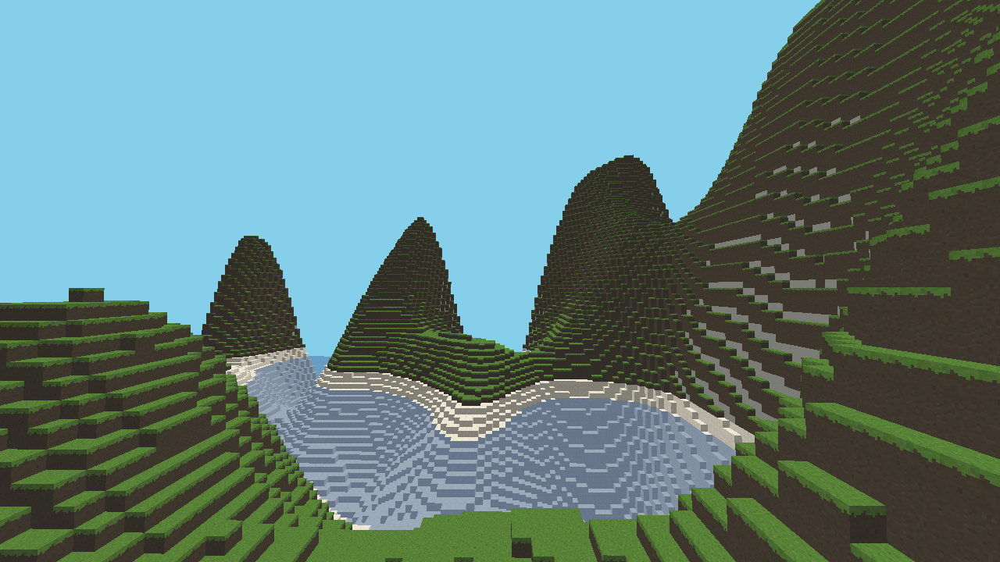

# Voxel Renderer
A Minecraft-esque voxel renderer written in C++ and OpenGL.



## Dependencies
### Linux (Ubuntu)
```bash
sudo apt install libwayland-dev libxkbcommon-dev xorg-dev
```

### Windows
Download and install [MSYS2](https://www.msys2.org/#installation) and [CMake](https://cmake.org/download). Update the Windows PATH env to include the package directory, typically `C:\msys64\ucrt64\bin`.

Then install the required packages from the MSYS2 terminal:
```bash
pacman -S mingw-w64-ucrt-x86_64-toolchain
```

## Building
### Linux
```bash
git clone https://github.com/justint9696/voxel-renderer.git --recurse-submodules
cd voxel-renderer
cmake -B build -S .
cmake --build build
```

### Windows
```bash
git clone https://github.com/justint9696/voxel-renderer.git --recurse-submodules
cd voxel-renderer
cmake -B build -S . -G "MinGW Makefiles"
cmake --build build
```

After a successful build has been made, the application can be ran from the **root directory** with `build/game`.
